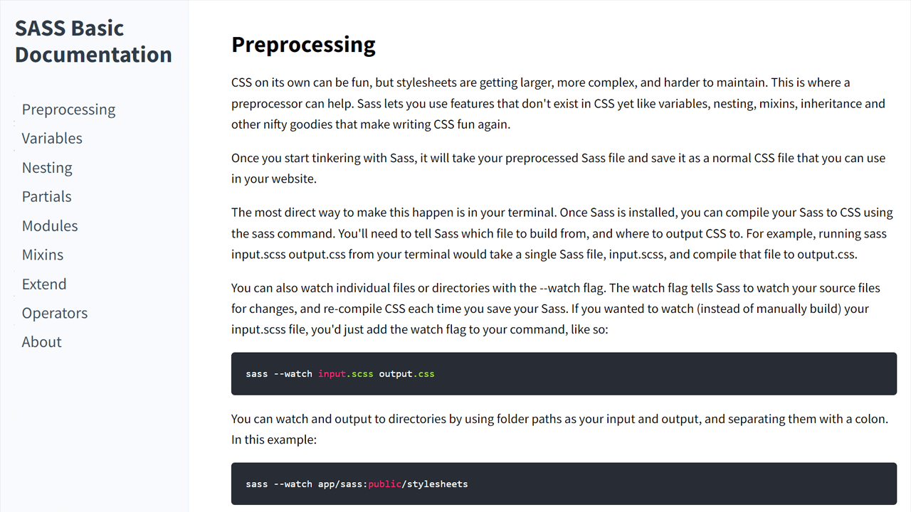

#  Technical Documentation Page

[Live Demo](https://constPardalos.github.io/technical-documentation-page/)

## Description

This is an assignment project from [freeCodeCamp.org](https://www.freecodecamp.org/).

The goal of this project is to create a technical documentation page using HTML, CSS and JavaScript if needed.
The end result should fulfill all the user stories specified in the [project's description](https://www.freecodecamp.org/learn/responsive-web-design/responsive-web-design-projects/build-a-technical-documentation-page).

## Resources

* Content from [sass-lang.com](https://sass-lang.com/)
* [highlight.js](https://highlightjs.org/) for syntax highlighting
